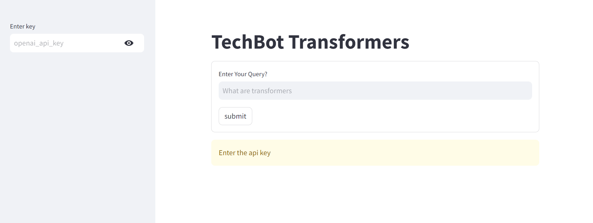

<h1>TechBot Transformers</h1>

The project aims to develop a question-answering system using LangChain tools and agents, along with OpenAI's GPT-3.5 model. The system retrieves relevant information from a set of blog posts and generates natural language answers to user queries. Streamlit is used to create a user-friendly interface for interacting with the system.

<h3>Key Components:</h3>
<ol>
   <li>
    Data Loading and Preprocessing:
  </li>
  <ul>
    <li>The WebBaseLoader is utilized to scrape content from a set of blog posts.</li>
    <li>The content is chunked and indexed using RecursiveCharacterTextSplitter and Chroma for efficient retrieval.</li>
  </ul>
  <li>
    Question Answering Pipeline:  
  </li>
  <ul>
    <li>The qa_model function orchestrates the question-answering pipeline.</li>
    <li>It initializes the LangChain retriever and loads the GPT-3.5 model from OpenAI.</li>
    <li>A prompt template from rlm/rag-prompt is used to guide the question answering process.</li>
    <li>The pipeline combines the retriever, prompt, and GPT-3.5 model to generate answers.</li>
  </ul>
 <li>
  User Interface:
  </li>
  <ul>
    <li>Streamlit is used for creating the user interface.</li>
  </ul>
</ol>

